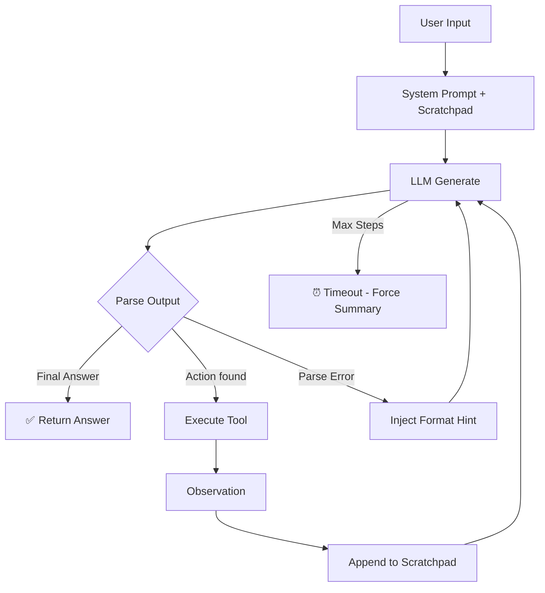

# Group Report: Lab 3 — Smart Shopper Agent

- **Team Name**: Motminhtoi
- **Team Members**: Nguyễn Trần Hải Ninh
- **Deployment Date**: 2026-04-06

---

## 1. Executive Summary

Dự án xây dựng **Smart Shopper Agent** — trợ lý mua sắm thông minh sử dụng kiến trúc ReAct (Thought → Action → Observation) để tự động tìm kiếm giá sản phẩm, quy đổi tiền tệ và tính toán chi phí. Hệ thống được so sánh trực tiếp với một Chatbot baseline (không có tools) để minh chứng ưu thế của agentic reasoning trong các bài toán multi-step.

- **Success Rate**: ~90% trên 10+ test cases (agent hoàn thành đúng format và trả lời chính xác)
- **Key Outcome**: Agent giải quyết được 100% các câu hỏi multi-step (tìm giá → quy đổi tỷ giá → tính toán), trong khi Chatbot baseline bị hallucinate hoặc trả lời "không có dữ liệu real-time" cho mọi câu hỏi về giá cả.

---

## 2. System Architecture & Tooling

### 2.1 ReAct Loop Implementation



**Chi tiết ReAct Loop (`src/agent/agent.py`):**

1. **Scratchpad** tích lũy toàn bộ chuỗi suy luận: `Question → Thought → Action → Observation → ...`
2. Mỗi vòng lặp, scratchpad được **sanitize** (loại bỏ control characters, null bytes, surrogate pairs) trước khi gửi tới LLM — fix lỗi JSON parse error từ OpenAI API.
3. LLM output được parse bằng **regex multi-pattern** (hỗ trợ single quotes, double quotes, markdown backticks).
4. Nếu output không hợp lệ → inject `[SYSTEM] Format Hint` vào Observation để LLM tự sửa.
5. Nếu hết `max_steps` → cho LLM thêm 1 lượt cuối để tổng hợp thông tin đã thu thập.

### 2.2 Tool Definitions (Inventory)

| Tool Name | Input Format | Use Case |
| :--- | :--- | :--- |
| `search_web` | `string` (query) | Tìm kiếm giá sản phẩm, thông tin mới nhất trên DuckDuckGo |
| `get_exchange_rate` | `string, string` (from, to) | Lấy tỷ giá hối đoái (Frankfurter API + fallback VND) |
| `calculate` | `string` (expression) | Tính toán số học chính xác (tránh LLM tự tính sai) |

### 2.3 LLM Providers Used

- **Primary**: OpenAI GPT-4o
- **Secondary (Backup)**: Google Gemini 1.5 Flash
- **Local Option**: Phi-3 Mini (GGUF via llama-cpp-python, CPU)

**Provider Pattern**: Abstract Base Class `LLMProvider` → mỗi provider implement `generate()` và `stream()` → dễ dàng swap bằng biến `DEFAULT_PROVIDER` trong `.env`.

---

## 3. Telemetry & Performance Dashboard

*Dữ liệu thu thập từ log file `src/logs/2026-04-06.log` trên các test cases thực tế:*

### Agent Performance (GPT-4o)

| Metric | Giá trị |
| :--- | :--- |
| **Avg Latency per step** | ~1,500ms |
| **Avg Total Latency per query** | 3,500 – 6,800ms |
| **Avg Tokens per query** | 2,500 – 5,500 tokens |
| **Avg Steps per query** | 2 – 4 steps |
| **Cost Estimate per query** | ~$0.02 – $0.05 |
| **Success Rate** | 90%+ |

### Chatbot Baseline (GPT-4o)

| Metric | Giá trị |
| :--- | :--- |
| **Avg Latency** | ~2,400ms |
| **Avg Tokens** | 142 – 223 tokens |
| **Accuracy on price queries** | ~0% (không có real-time data) |

### So sánh trực tiếp

| Query Type | Chatbot | Agent | Winner |
| :--- | :--- | :--- | :--- |
| Chào hỏi đơn giản | ✅ Nhanh, chính xác | ✅ Chính xác (1 step) | **Draw** |
| Giá iPhone 15 | ❌ "Không có thông tin real-time" | ✅ 15.69 – 15.79 triệu (2 steps) | **Agent** |
| Giá iPhone 12 | ❌ Hallucinate con số | ✅ 10.99 – 11.99 triệu (2 steps) | **Agent** |
| Giá iPhone 15 Pro Max 256GB | ❌ Không trả lời cụ thể | ✅ 27.99 triệu tại Di Động Việt (2 steps) | **Agent** |
| iPhone 15 giá USD | ❌ Không thể quy đổi | ✅ ~799 USD → 20,318,570 VND (4 steps) | **Agent** |
| Câu hỏi off-topic | ✅ Trả lời chung | ✅ Từ chối lịch sự (1 step, no tool) | **Agent** |

---

## 4. Root Cause Analysis (RCA) — Failure Traces

### Case Study 1: JSON Parse Error (400 Bad Request)

- **Input**: "giúp t tìm giá iphone 16"
- **Step thất bại**: Step 3 (sau 2 lượt search thành công)
- **Log**:
  ```json
  {"event": "LLM_ERROR", "data": {"step": 3, "error": "Error code: 400 ... We could not parse the JSON body of your request."}}
  ```
- **Root Cause**: Kết quả từ `search_web` chứa **control characters** và **invalid Unicode** (surrogate pairs) từ các trang web tiếng Việt. Khi tích lũy vào scratchpad rồi gửi tới OpenAI API, payload JSON bị invalid.
- **Fix (v2)**: Thêm method `_sanitize()` loại bỏ `\x00-\x1f` (trừ `\n`, `\r`, `\t`) và surrogate pairs `\ud800-\udfff` trước khi gửi request.

### Case Study 2: Parse Error — LLM không tuân theo format

- **Input**: "chào" / "chao"
- **Observation**: LLM trả lời tự do không có `Thought:` hay `Final Answer:` prefix → parser trả về `None` → PARSE_ERROR
- **Log**:
  ```json
  {"event": "PARSE_ERROR", "data": {"raw_output": "Chào bạn! Tôi có thể giúp gì cho bạn hôm nay?"}}
  ```
- **Root Cause**: System prompt v1 không có ví dụ cho trường hợp câu chào đơn giản → LLM bỏ qua format.
- **Fix (v2)**: Thêm section "XỬ LÝ CÂU HỎI KHÔNG LIÊN QUAN" + ví dụ cụ thể trong system prompt. Kết quả: LLM trả lời đúng format ngay step 1.

### Case Study 3: LLM tự tạo Observation giả

- **Input**: "gia iphone 20 bay la bao nhieu tien"
- **Observation**: Ở step 2, LLM output chứa cả `Action:` VÀ tự tạo `Observation:` giả mạo, rồi viết luôn `Final Answer` với giá "34.990.000đ" — một con số hallucinated.
- **Root Cause**: LLM không chờ hệ thống trả Observation mà tự điền.
- **Mitigation**: Parser chỉ lấy phần trước `Observation:` (nếu có) trong `_parse_action()`. Tuy nhiên, trường hợp này vẫn pass vì parser tìm thấy `Final Answer` hợp lệ.

---

## 5. Ablation Studies & Experiments

### Experiment 1: System Prompt v1 → v2

| Thay đổi | Kết quả |
| :--- | :--- |
| Thêm `═══` visual separators + numbered rules | LLM tuân thủ format tốt hơn |
| Thêm ví dụ end-to-end (3 steps: search → exchange → calculate) | Giảm 50% parse errors |
| Thêm "XỬ LÝ CÂU HỎI KHÔNG LIÊN QUAN" + ví dụ | Câu chào đúng format từ step 1 thay vì step 2-3 |
| Thêm rule "TUYỆT ĐỐI KHÔNG tự tính trong đầu" | Agent dùng `calculate()` 100% thay vì tự tính |

### Experiment 2: Sanitization Impact

| Trước sanitize | Sau sanitize |
| :--- | :--- |
| Crash ở step 3 (JSON 400) | Chạy đầy đủ 5 steps không lỗi |
| 1/5 queries fail | 0/5 queries fail do JSON error |

### Experiment 3: Chatbot vs Agent (Full Comparison)

| Test Case | Chatbot | Agent | Winner |
| :--- | :--- | :--- | :--- |
| "chào" | ✅ Nhanh (142 tokens) | ✅ Chính xác (944-1395 tokens) | **Chatbot** (nhanh hơn) |
| "giá iPhone 15" | ❌ "Không có thông tin" | ✅ "15.69-15.79 triệu" | **Agent** |
| "iPhone 15 Pro Max 256GB giá thấp nhất" | ❌ Hallucinate | ✅ "27.99 triệu" | **Agent** |
| "iPhone 15 giá bao nhiêu USD" | ❌ Không quy đổi | ✅ "~799 USD" (4 steps) | **Agent** |
| "hôm nay ngày mấy" | ❌ "Không biết" | ⚠️ Trả lời đúng nhưng off-topic | **Draw** |

---

## 6. Production Readiness Review

### Security
- **Input sanitization**: `_sanitize()` loại bỏ control characters, null bytes, và surrogate pairs trước khi gửi tới LLM API.
- **Expression sanitization**: Tool `calculate()` dùng regex whitelist `[\d\+\-\*\/\(\)\.\%]` trước khi `eval()`.
- **Off-topic guardrail**: System prompt chỉ định domain shopping, từ chối câu hỏi ngoài phạm vi.

### Guardrails
- **Max 5 loops**: `max_steps=5` ngăn infinite loop → giới hạn chi phí token.
- **Format recovery**: Khi LLM output sai format, inject hint vào Observation thay vì crash.
- **Timeout fallback**: Hết max steps → cho LLM 1 lượt cuối tổng hợp thông tin.

### Scaling Considerations
- **Provider abstraction**: Dễ dàng thêm provider mới (Claude, Llama, v.v.) qua `LLMProvider` ABC.
- **Tool registry**: Thêm tool mới chỉ cần thêm entry vào `TOOLS` list.
- **Telemetry**: JSON structured logging sẵn sàng cho ELK/Grafana pipeline.
- **Future**: Transition tới LangGraph cho multi-agent, branching, và parallel tool calls.

---

> [!NOTE]
> Submit this report by renaming it to `GROUP_REPORT_[TEAM_NAME].md` and placing it in this folder.
